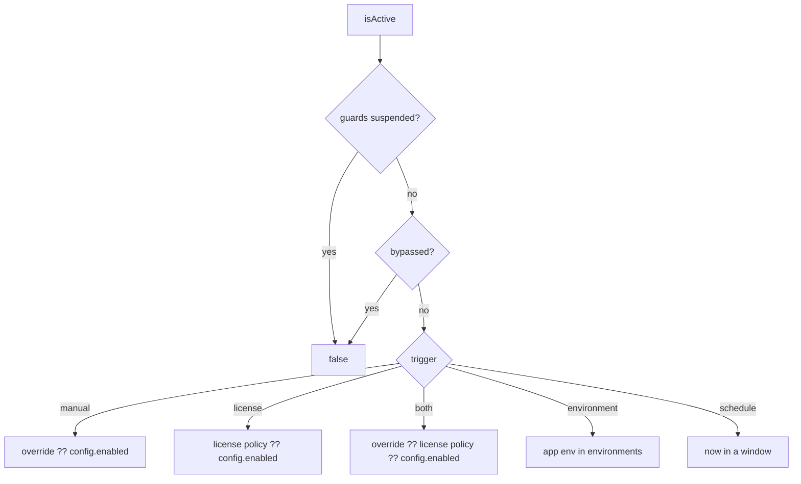
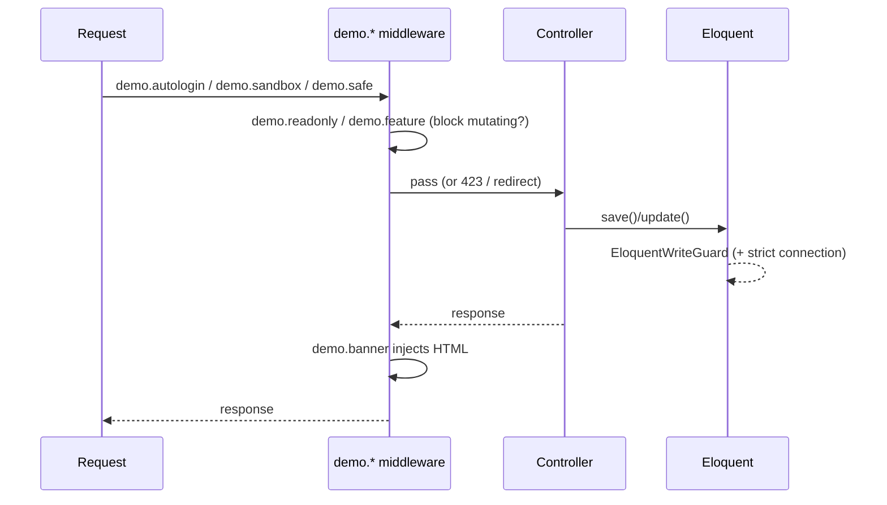
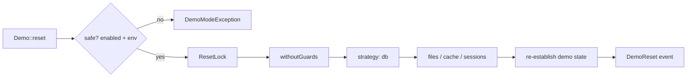

# Architecture

The components behind demo-mode and how activation, requests, and resets flow through them.

## Components

- **`DemoMode`** — the orchestrator (facade target). Memoises the base decision per
  request; evaluates bypass fresh; exposes the public API.
- **`State/DemoState`** — resolves the base decision by `trigger`.
- **`State/BypassResolver`** — IP / gate / role / ability / id exemptions.
- **`Policies/*`** — `ConfigDemoPolicy` (the toggle) and `LicenseDemoPolicy` (maps license
  state to a decision; abstains when no license source is present).
- **`Contracts/LicenseGateway`** — soft seam over the verifier (`Null` vs `Verifier` adapter).
- **`Features/FeatureRegistry`** — named feature gating (entitlement-aware).
- **`Guards/*`** — `EloquentWriteGuard`, `WriteBlockingConnection`, `ConsoleGuard`, side-effects.
- **`Reset/*`** — `ResetManager` + `ResetStrategy` drivers + `ResetLock` + `FileResetter`.
- **`Sandbox/*`** — `SandboxContext` + strategies; `Concerns/BelongsToDemoSandbox`.

## Activation resolution

## Request flow

## Reset flow

## Prior art

`demo-mode` was designed after surveying the Laravel ecosystem; each existing package is
narrower:

- **spatie/laravel-demo-mode** (archived) — password access-gate.
- **rappasoft/lockout** — global GET-only read-only flag.
- **dgvai/laravel-demo-mode** — blocks POST to tagged routes + a flash message.
- **spatie/laravel-db-snapshots**, **spatie/laravel-backup** — reset/restore building blocks.
- **stancl/tenancy** — per-visitor isolation.
- **lab404/laravel-impersonate** — demo auto-login.

demo-mode unifies these and adds license-aware activation, layered write protection
(incl. mass-op blocking), granular per-model/route/feature control, pluggable reset
strategies, and guard suspension.

---

[← Docs index](../README.md#documentation)
